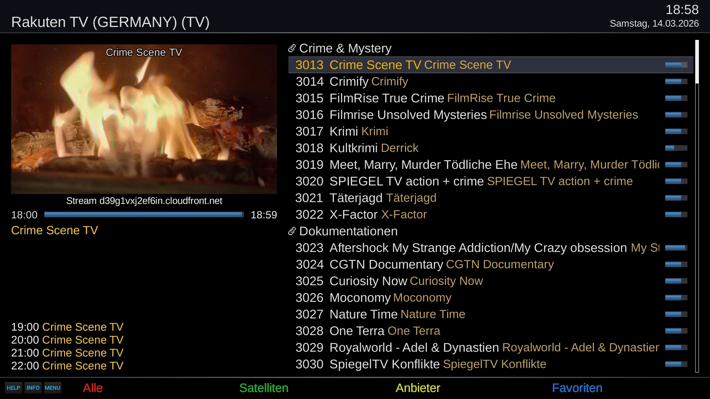
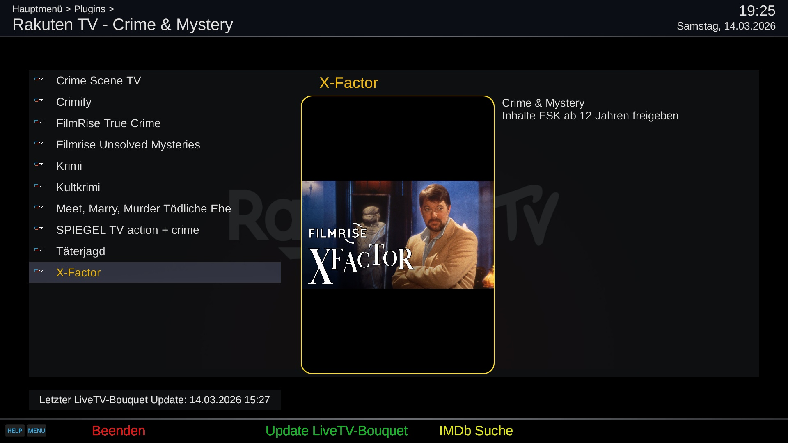

# Rakuten TV (RTV)
Open-Enigma2 plugin for Live-TV and VoD streams

## Live-TV

## Video-On-Demand

## Features
- Playback of Rakuten TV channels by country
- Live TV bouquet creation with EPG support
- VoD-style channel browsing by category
- Picon (channel icon) management
- Resume point support for VoD playback
- TMDb/IMDb integration for movie/show info
- Poster display for VoD movies

## Supported Regions
- Austria,
- Switzerland,
- Germany,
- Denmark,
- Spain,
- Finland,
- France,
- Ireland,
- Italy,
- Netherlands,
- Norway,
- Poland,
- Romania,
- Sweden",
- United Kingdom

## Limitations
- Rakuten TV supports OpenViX and compatible Open Enigma2 distributions.
- Skin is optimized for Simple_Ten_Eighty system skin.

## Languages
- english
- german

## Links
- Installation: https://opencockpit.github.io/RakutenTV
